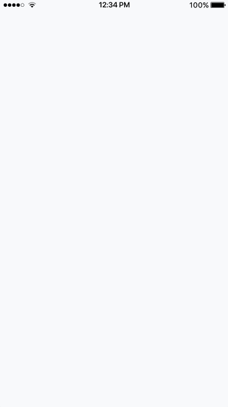

# ionic2-animated-splashscreen
An animated splashscreen for Ionic 2 with tab bar. This is currently not possible with cordova, so this is done with html and css.
Tab bar will slide up after the splash screen.

This is an ionic 2 tabs starter combined with a side menu

## Getting Started

* run `npm install` from the project root
* Run `ionic serve` from the project root
